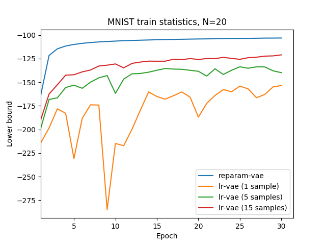
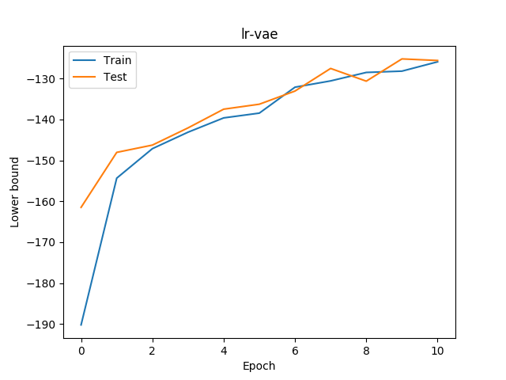
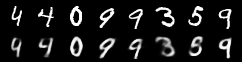
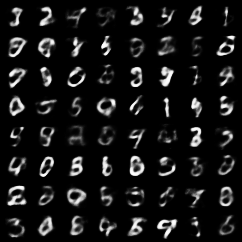

## Using the likelihood ratio gradient estimator to train variational autoencoders.

From the following plot, we can see that using the reparameterization trick, one can obtain a much higher value of the variational lower bound. Also, drawing more samples from the posterior per datapoint to estimate the gradient helps to reduce the variance of the likelihood ratio gradient estimator:

The following plot shows the lower bound of lr-vae trained for 10 epochs while drawing 20 samples per datapoint from posterior. We see that the KL term implicitly regularizes the model, not letting it overfit the dataset.

Reconstruction after 10 epochs of training (actual samples in the first row, reconstruction in the second):

Some samples drawn after 10 epochs of training:

