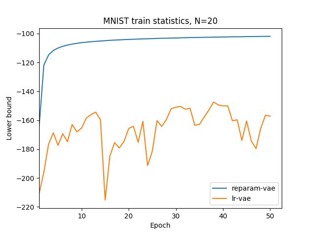

## Using the likelihood ratio gradient estimator to train variational autoencoders.

From the following plot, we can see that using the reparameterization trick, one can obtain a much higher value of the variational lower bound. Also, drawing more samples from the posterior per datapoint to estimate the gradient helps to reduce the variance of the likelihood ratio gradient estimator:

